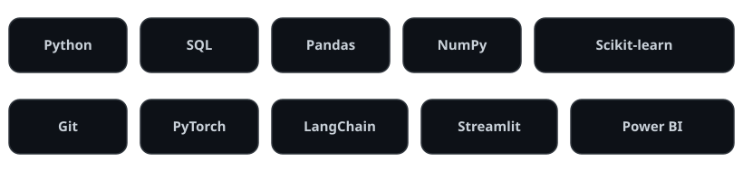
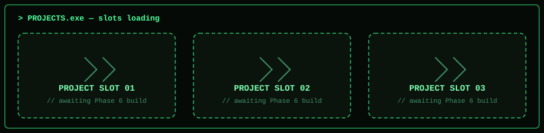

<h1 align="center">Hi, I'm Mohammed Sofiyaan 👋</h1> 
  

🧭 Identity Scan

  

💻 Live Terminal

  

📍 Roadmap Status

  

🛠️ Tech Stack

  

📌 Projects

  
 <!-- Replace project-cards.svg content directly once real projects exist, or swap this block for real repo cards like: ### [Project Name](https://github.com/Sofiyaan12/project-repo) One-line description of what it does and what you used to build it. -->
⏱️ Coding Activity (WakaTime)
<!--START_SECTION:waka--> <!-- This section auto-updates once the WakaTime Action below is set up --> <!--END_SECTION:waka-->
📊 GitHub Stats

   
 
  

🐍 Contribution Snake

  

🌐 Connect With Me

   

