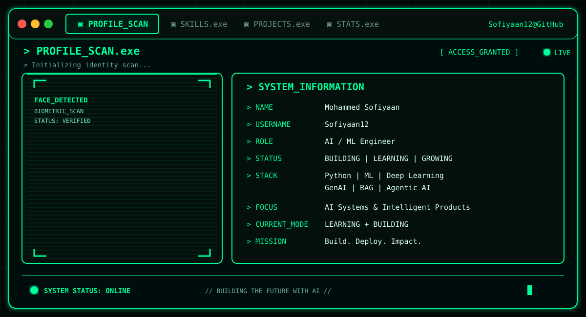

<div align="center">



<br><br>



</div>

---

<h2 align="center">⚡ MOHAMMED SOFIYAAN</h2>

<p align="center">
  <b>AI / ML Engineer</b> • Python • Machine Learning • Deep Learning • GenAI • RAG • Agentic AI
</p>

<p align="center">
  <a href="https://github.com/Sofiyaan12">
    
  </a>
  <a href="https://www.linkedin.com/in/sofiyaaan/">
    
  </a>
</p>

---

## 🧠 SYSTEM PROFILE

```text
┌──────────────────────────────────────────────────────────────┐
│                    SOFIYAAN // AI SYSTEM                     │
├──────────────────────────────────────────────────────────────┤
│                                                              │
│  NAME        : Mohammed Sofiyaan                             │
│  ROLE        : AI / ML Engineer                              │
│  STATUS      : Building                                      │
│  LOCATION    : India                                         │
│                                                              │
│  CORE        : Python                                        │
│  ML          : Scikit-Learn                                  │
│  DEEP        : PyTorch                                       │
│  GENAI       : LLMs • RAG • Agents                           │
│  TOOLS       : Git • GitHub • VS Code                        │
│                                                              │
│  CURRENT     : Learning → Building → Deploying              │
│                                                              │
└──────────────────────────────────────────────────────────────┘
